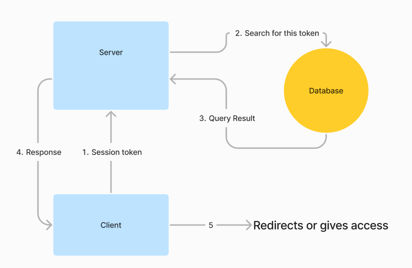
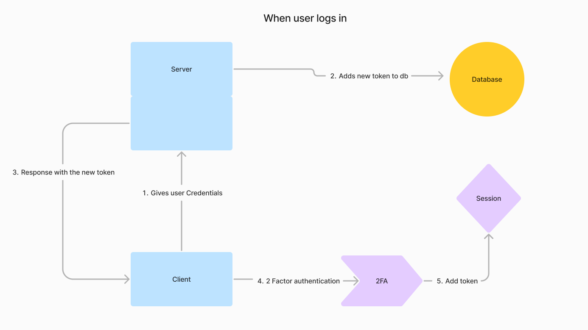
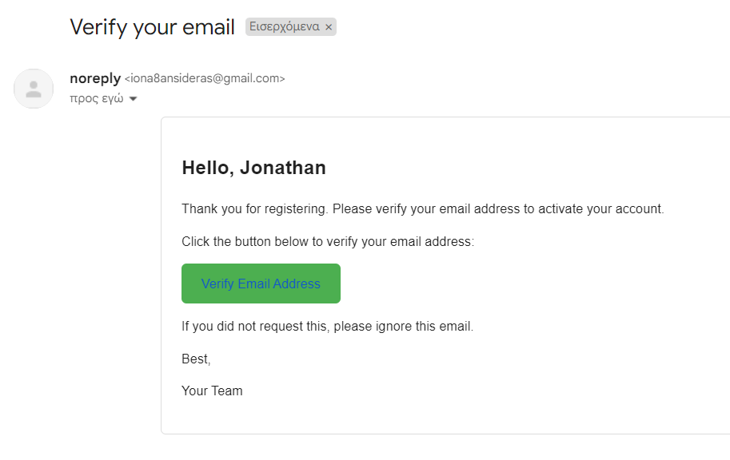

# 🔐 Authentication Logic

This document describes the authentication logic used in this application.

## 🔍 Page Access Authentication

When a user attempts to access a page, the application performs an authentication check to determine whether the user is allowed to view the page. This process works as follows:

1. The user navigates to a page. 🚶
2. The application sends a request to the server, including the user's `sessionToken`. 📡
3. The server receives the request and extracts the `sessionToken`. 📥
4. The server queries the database to find a document that matches the provided `sessionToken`. 🗄️
5. If a matching document is found, the server sends a response indicating that the user is authenticated. ✅
6. If no matching document is found, the server sends a response indicating that the user is not authenticated. ❌
7. The application receives the server's response. 📬
8. If the response indicates that the user is authenticated, the application allows the user to view the page. 👀
9. If the response indicates that the user is not authenticated, the application redirects the user to a different page (e.g., a login page). 🔄

This process ensures that only authenticated users with a valid token can access certain pages. The `sessionToken` should be stored securely on the client side and included in every request to the server.

## 🔑 Session Token Creation on Login

When a user logs in, a new session token is created for them. This process works as follows:

1. The user submits their login credentials. ✏️
2. The application sends a request to the server, including the user's credentials. 📡
3. The server validates the credentials and, if they are correct, creates a new session token. 🔐
4. The server adds the new session token to the user's document in the database. 🗄️
5. The server sends a response to the application, including the new session token. 📬
6. The application receives the server's response and extracts the session token. 📤
7. The application stores the session token in the user's session, setting it to expire after 30 days. ⏳

This process ensures that each user has a unique session token that can be used to authenticate them. The session token is created on the server side, stored in the database, and sent to the client side where it is stored in the user's session.

## 📧 Email Verification

This application uses Nodemailer to send a verification email to the user's email address to confirm its validity. This process works as follows:

1. When a user signs up, the application generates a unique verification token. 🔑
2. The application stores the verification token in the user's document in the database. 🗄️
3. The application sends a verification email to the user's email address. The email includes a link with two query parameters: `email` and `token`. The `email` parameter is the user's email address, and the `token` parameter is the verification token. 📧

    

4. The user clicks the link in the verification email. 🖱️
5. The application reads the `email` and `token` query parameters from the URL. 🔍
6. The application sends a request to the server, including the `email` and `token`. 📡
7. The server queries the database to find a document that matches the provided `email` and `token`. 🗄️
8. If a matching document is found, the server marks the user as verified in the database and sends a response indicating that the email has been verified. ✅
9. If no matching document is found, the server sends a response indicating that the email could not be verified. ❌

This process ensures that the user has access to the email address they provided. If a user is not verified, they cannot access certain pages in the application.
